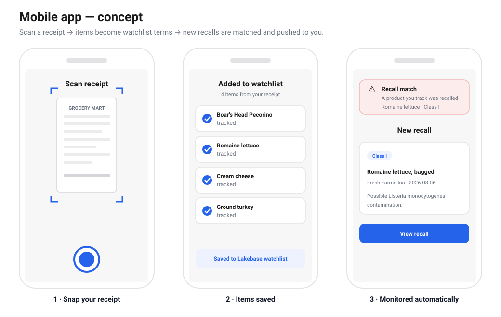

# Product Recalls

An end-to-end **US food-recalls** app built on Databricks: semantic search, an AI assistant, and a
personal watchlist over openFDA food-recall data.

## What it does

- **Search** — semantic (vector) search over ~1,000 recent openFDA food recalls; ranked matches with
  brand, date, classification, and hazard. Deterministic, no LLM.
- **Assistant** — a Mosaic AI agent that reads your request and decides whether to *answer* (search)
  or *act* (add a term to your watchlist). "any listeria recalls?" and "watch romaine for me" look
  alike but mean opposite things — that read-vs-write intent split is why it uses a model.
- **Watchlist** — save terms and see current matches for each when you open the app. **Pull, not
  push**: nothing runs in the background and nothing notifies you.

## Architecture

One unified table feeds every downstream layer:

```
openFDA API  →  adw.recalls.unified (Unity Catalog)  →  Lakebase (Postgres) + Vector Search index
             →  agent (2 tools)  →  Databricks App
```

| Step | What | Tech |
|---|---|---|
| 1 · Ingest | openFDA food enforcement → one table `adw.recalls.unified` (1000 rows, `recall_id` PK) | Unity Catalog, PySpark |
| 2 · Lakebase | load `recalls` + create `watchlist` | Lakebase (managed Postgres), psycopg2 |
| 3 · Vector Search | `unified_search` (search_text + CDF) → delta-sync index with managed embeddings | Vector Search, `databricks-gte-large-en` |
| 4 · Agent | 2 tools — `search_recalls` (read) + `add_to_watchlist` (write) — as an MLflow `ChatAgent`, registered in Unity Catalog | Mosaic AI Agent Framework, MLflow |
| 5 · App | Flask + single-page UI: `/search`, `/chat` (in-process agent), `/watchlist` | Databricks Apps, Flask |

The shared code (`agent.py`, `tools.py`, `lakebase.py`) lives in `app/` because Databricks Apps
deploys only that folder — the notebooks and the app import the same modules.

> Scope: openFDA food recalls only (phase 1). USDA FSIS is a planned phase 2 — the schema and
> pipeline already accommodate it. See [`implementation.md`](implementation.md) for the step-by-step
> build log and [`docs/`](docs) for architecture notes.

# Screenshots

https://recalls-7405613269176411.11.azure.databricksapps.com


# To Do

## Mobile App

A consumer front-end that turns the watchlist into a zero-effort habit — instead of typing terms,
you scan what you actually bought:

1. **Snap your receipt** — photograph a grocery receipt; OCR extracts the line items.
2. **Items are saved** — the extracted product/brand names become watchlist terms in Lakebase, tied
   to your account (reusing the agent's `add_to_watchlist` write).
3. **Monitoring runs automatically** — new recalls are matched against your saved items and pushed to
   you when one hits.



This is the **push** half the current MVP deliberately skips (see *Future work* in
[`implementation.md`](implementation.md)): scheduled ingest + change detection (a `first_seen`
column) + delivery. No new backend architecture — the web app already proves the round-trip; the
mobile app just adds an OCR on-ramp and flips **pull → push**.

## Lakebase Table 'Recalls'

The Lakebase `recalls` table (loaded in Step 2) is **unused by the app** — every recall shown in the
UI comes back through the Vector Search index, never from Postgres. Once the index was built to
return the full display columns (Step 3), the app renders results in one call with no join back to
Lakebase, which removed the reason for this table. It's also **stale**: Step 2 is a one-time
`psycopg2` load with no auto-sync, so it drifts from `adw.recalls.unified` on any re-ingest.

Two options:

- **Drop it (cleanest).** Removes a frozen, unread copy of ~1,000 rows and the drift it invites.
  `DROP TABLE recalls;` in Lakebase. The app is unaffected — it doesn't reference this table.
  Recommended unless the option below is on the roadmap. Note: keep the `watchlist` table; that one
  *is* load-bearing (the app reads and writes it live).

- **Keep it only for faceted / filtered querying.** Semantic (vector) search is weak at exact
  filters and ordering — "show all **Class I** recalls," "filter by **brand**," "sort by **date**."
  A relational `recalls` table in Postgres answers those with plain indexed `WHERE` / `ORDER BY`,
  complementing the semantic `/search`. If structured browsing like that is planned, keep the table
  (and switch its load to a keep-in-sync path — a UC→Lakebase synced table, or re-run the load on
  each ingest — so it stops going stale).