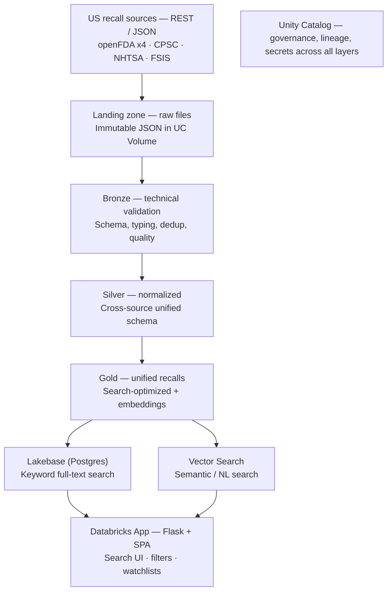

# US Product Recalls — Ingestion & Search on Databricks

Architecture for ingesting US government recall data into a Databricks lakehouse and serving it through a searchable app.

## Goal

- Ingest recalls from all US federal sources (FDA, CPSC, NHTSA, USDA-FSIS).
- Normalize them into one unified schema.
- Serve a fast search app (keyword + optional semantic) over the combined dataset.

## Flow

Unity Catalog governs every layer (catalog, schemas, the landing Volume, secrets). Orchestration is a single daily Lakeflow Job; transforms run as a Lakeflow Declarative Pipeline (or dbt-core).

## Layers

Clean, non-overlapping responsibilities. The dividing line: **landing = bytes as received · bronze = valid rows · silver = unified meaning · gold = query-ready.** If you ever rename a field in bronze, it belongs in silver; if you drop a malformed row in silver, it belonged in bronze.

### Landing zone — raw file archive
The Lakeflow Job writes each API response to a UC Volume exactly as received: immutable, partitioned by `source/ingest_date`, no parsing, schema-on-read. This is the replay-and-audit source of truth. Because several agencies prune their own history, the landing zone is what lets you rebuild everything downstream and prove exactly what an API returned on a given day. Nothing downstream mutates it.

### Bronze — technical validation only
Auto Loader reads landing files into the first Delta table. Structural checks only: enforce/evolve schema, parse types and timestamps, add ingestion audit columns, dedup on the source's natural key, apply Lakeflow expectations that are purely technical (is `recall_number` present, is `recall_date` parseable, is the row a structural duplicate). Malformed rows are quarantined or dropped, not reasoned about. Bronze stays **source-shaped** — one table per source, original field names, no cross-source logic. It answers "is this record well-formed?" not "what does it mean?"

### Silver — business normalization
Cross-source mapping into the unified `recalls` schema: reconcile field names, standardize category and severity, harmonize the Class I–III vs. NHTSA/CPSC classification mismatch, business-rule dedup across representations. Bronze made each source clean; silver makes them one.

### Gold — serving shape
Search-optimized unified table plus the full-text search vector and embeddings, synced out to Lakebase and Vector Search.

## Ingestion — per-source strategy

One scheduled Lakeflow Job runs daily with a task per source (or one parametrized task looping a source registry). Backfill once, then incremental by date. Bronze is append-only, so it becomes the durable archive that outlives upstream pruning.

| Source | Endpoint | Pagination / bulk strategy | Note |
|---|---|---|---|
| openFDA (×4) | `api.fda.gov/{food,drug,device}/enforcement.json`, `/device/recall.json` | `limit=1000` + `search_after` (skip caps at 26k) | Backfill with sorted `search_after` cursor; daily incremental on `report_date` |
| CPSC | `saferproducts.gov/RestWebServices/Recall?format=json` | Full pull, or `RecallDateStart` filter | Bare call returns the whole set (~20MB) — grab whole and diff |
| NHTSA | bulk flat file `static.nhtsa.gov/odi/ffdd/rcl/` | Download + parse pipe-delimited | Use the flat file, **not** `recallsByVehicle` (that API needs make/model/year — useless for bulk) |
| FSIS | `fsis.usda.gov/fsis/api/recall/v/1` | Full JSON array | Small; pull whole, filter by `field_recall_date` |

All are no-auth (openFDA takes an optional free key for higher rate limits). Store the key in a Unity Catalog secret scope.

## Unified schema (silver / gold)

| Column | Notes |
|---|---|
| `recall_id` | surrogate: `source_code::native_id` |
| `source` / `agency` | `openfda_food` / `FDA`, `cpsc` / `CPSC`, `nhtsa` / `NHTSA`, `fsis` / `USDA-FSIS` |
| `category` | food, drug, medical_device, vehicle, meat_poultry, consumer_product |
| `title`, `product_description`, `brand` | free-text (search targets) |
| `recall_date`, `status` | normalize status to ongoing / completed / terminated |
| `classification` | FDA/FSIS Class I–III; map NHTSA/CPSC severity onto a common ordinal |
| `reason_hazard` | recall reason / hazard text |
| `country` | constant `US` (leaves room to add jurisdictions later) |
| `source_url`, `ingested_at`, `_raw` | `_raw` kept as VARIANT for anything unmapped |

`classification` is the awkward field — FDA and FSIS use Class I/II/III, CPSC and NHTSA don't. Keep a nullable native classification alongside a normalized severity ordinal.

## Serving & search

Two paths off gold:

**Keyword — Lakebase (Postgres).** Sync gold into Lakebase, build a `tsvector` GIN index over `title + product_description + brand + reason_hazard`, query with `plainto_tsquery` + `ts_rank`. Sub-second keyword search with filters on category, agency, classification, date, status. Uses the `lakebase.py` + psycopg2 pattern.

**Semantic — Databricks Vector Search (optional).** A Delta-sync index over the embedded description enables natural-language queries ("listeria in packaged deli meat") that keyword search misses. The app can expose a keyword/semantic toggle, or blend both (keyword filter → vector rerank).

## The app

A Databricks App: Flask backend + SPA frontend, bound to `0.0.0.0:$DATABRICKS_APP_PORT`, identity via `X-Forwarded-Email`.

Endpoints (approx.):
- `GET /api/search?q=&category=&agency=&class=&from=&to=`
- `GET /api/recall/<id>`
- `GET/POST /api/watchlist` — keyed on forwarded email; user saves brands/categories and sees new matches. Watchlist table lives in Lakebase alongside the synced recalls.

## Key decisions

- **Batch, not streaming.** Recalls update daily at most. One daily Lakeflow Job across all sources is simplest and cheapest. Backfill once (openFDA cursor, CPSC/FSIS whole-set, NHTSA flat file), then incremental by date.
- **Lakebase as primary serving layer.** You *could* query gold directly via a SQL Warehouse (no sync job), but for an interactive search UI Lakebase gives real Postgres full-text ranking and lower latency. Keep the SQL Warehouse as the analytics/BI path against gold.
- **Store everything on ingest.** The landing zone is immutable and append-only bronze is the durable archive; since sources prune, your store becomes more complete than several upstreams.

## OSS-stack alternative

The naming now collides three ways, so alias clearly in the repo:

- `dlt` (dlthub) — could replace the custom extraction; its declarative REST source with incremental loading fits these APIs well.
- Dagster — could orchestrate instead of Lakeflow Jobs.
- dbt-core — could own the silver/gold transforms.

All valid, but inside Databricks the idiomatic path is Lakeflow Jobs + Auto Loader + Declarative Pipelines, keeping everything under one governance and lineage plane. Note Databricks' own pipeline import is now `from pyspark import pipelines as dp` (formerly `import dlt`) — distinct from the dlthub `dlt` package.
